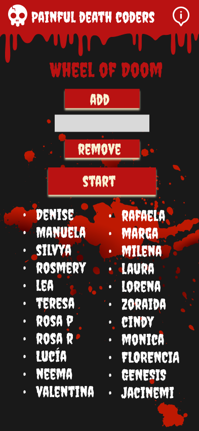
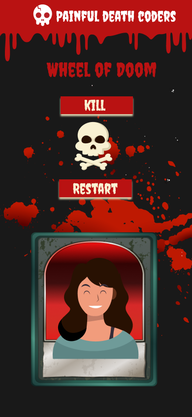

# Wheel of the Doom

_Proposal_

The Sacrificios SAS association, a great event such as the purge and others; needs a new application for coders sacrifice event. The application must be a fair and random sacrifice system, in which a draw will be made from a list of names.

_Description_

We have developed a game whith a fair and aleatory system will choose a coder to died. if you want you can add or delete a coder.

_Mockup:_

## CONTENTS

- [Project name: Wheel of the Doom](#project-name-wheel-of-the-doom)
  - [CONTENTS](#contents)
    - [General Info](#general-info)
    - [Technologies](#technologies)
    - [Tools](#tools)
    - [Developers](#developers)

### General Info

_General objective:_

The main objective is the creation of a landing page proposed by the client with the priority that the user can interact with it, so that they can sacrifice coders.
It should be able to work on any device and adapt accordingly.

Especific objetives:
 - Create a random and fair coder sacrifice system.
-- Layout an application - Level 3: Create
- Create a dynamic and adaptable web user interface.
- Manipulate web events and execute actions in Javascript.
- Know the correct use of tools and technologies.

### Technologies

 

 

### Tools

 

### Developers

        Rosmery Medina.
        Manuela Pérez.
        Lucía Silva.
        Denise Khurlopian.
